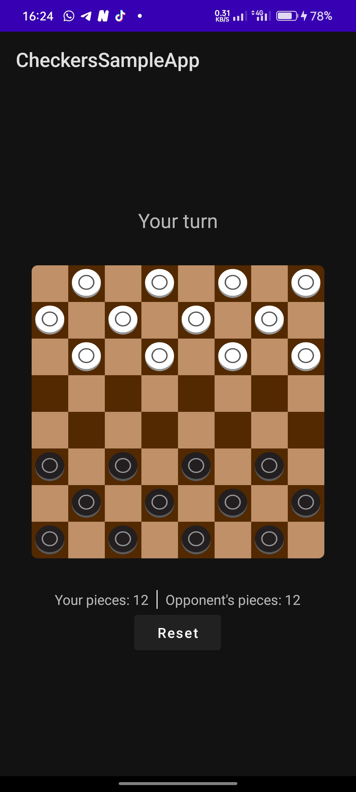

# CheckersBoardView

**CheckersBoardView** is a customizable Android View for displaying a classic **Checkers** (Draughts) board.  
You can easily integrate it into your app, customize the appearance with XML attributes, and even define custom game rules!  
It also supports playing against a computer opponent powered by the **Minimax algorithm**.

---

## ✨ Features

- Customizable dark and light tile colors
- Responsive and scalable board
- Easy XML integration
- Lightweight and fast
- Listen to board events like win, piece capture, and active player switches
- Support for custom checkers game rules
- Built-in AI opponent using the Minimax algorithm

---

## 📦 Installation

<summary><b>Gradle</b></summary>

```gradle
implementation 'com.github.iamgerryshom:CheckersBoardView:2.1.3'
```

---

## 🚀 Usage

### XML Setup
Add the `CheckersBoardView` to your layout:

```xml
<com.gerryshom.checkersboardview.view.CheckersBoardView
    android:id="@+id/checkersBoardView"
    android:layout_width="match_parent"
    android:layout_height="match_parent"
    android:layout_gravity="center"
    android:layout_margin="32dp"
    app:darkTileColor="#212121"
    app:lightTileColor="#494949" />
```

---

### Programmatic Setup

```java
// Define players
final Player opponentPlayer = Player.computer(); // Built-in computer opponent
final Player humanPlayer = new Player("Human", "Human");

// Set up Checkers board
binding.checkersBoardView.setLocalPlayer(humanPlayer)
    .addMoveSequenceListener(moveSequence -> {
        // Triggered when a player's piece finishes its move sequence
        // 'moveSequence' contains a list of all the moves made
    })
    .addPlayerSwitchedListener(newActivePlayer -> {
        // Triggered after a player completes their turn and it's the opponent's turn
        binding.tvActivePlayer.setText(
            newActivePlayer.getId().equals(Player.computer().getId())
                ? "Computer's turn"
                : "Your turn"
        );
    })
    .addWinListener(winnerPlayer -> {
        // Triggered when either player cannot make any more valid moves
        binding.tvActivePlayer.setText(
            winnerPlayer.getId().equals(Player.computer().getId())
                ? "Computer Won"
                : "You Win"
        );
    })
    .addPieceCapturedListener((capturedPiecePlayerId, remainingPieceCount) -> {
        // Triggered whenever a piece is captured (single or chained)
        if (capturedPiecePlayerId.equals(Player.computer().getId())) {
            binding.tvOpponentPieceCount.setText("Computer: " + remainingPieceCount);
        } else {
            binding.tvMyPlayerPieceCount.setText("You: " + remainingPieceCount);
        }
    })
    // Choose one of the setup methods below:
    
    // For syncing the board state in multiplayer (online or LAN)
    //.setup(checkersBoard)

    // For local single-device play (e.g., against the computer or friend)
    .setup(humanPlayer.getId(), opponentPlayer);

```

---

### Rules

```java
// Define the rules for piece capturing
final CaptureRule captureRule = new CaptureRule(
    true,  // forceCapture: player must capture if able
    true,  // allowMultiCapture: allow multiple sequential jumps
    false  // mustTakeLongestJumpPath: not enforced
);

// Define the rules for overall game flow
final GameFlowRule gameFlowRule = new GameFlowRule(
    12, // maxTurnsWithoutCapture: max turns before draw
    60  // maxTurnDurationSeconds: max time per move in seconds
);

// Define the rules for King pieces
final KingPieceRule kingPieceRule = new KingPieceRule(
    0,     // maxMoveSteps (0 = unlimited)
    0,     // maxLandingStepsAfterCapture (0 = unlimited)
    false, // canChangeDirectionDuringMultiJump
    false  // canMoveImmediatelyAfterPromotion
);

// Define the rules for Normal pieces
final NormalPieceRule normalPieceRule = new NormalPieceRule(
    true,  // restrictToForwardMovement
    true,  // allowBackwardCapture
    true   // promoteOnlyAtLastRow
);

/*
 * If no rules are set explicitly, default rules will apply.
 */
binding.checkersBoardView.setRule(captureRule);
binding.checkersBoardView.setRule(gameFlowRule);
binding.checkersBoardView.setRule(kingPieceRule);
binding.checkersBoardView.setRule(normalPieceRule);
```

---

### Playing Moves

```java
/**
 * In a remote player setup,
 * take the MoveSequence from the remote player and apply it.
 * This won't trigger your local moveSequence listener.
 */
binding.checkersBoardView.playOpponentMoveSequence(remotePlayerMoveSequence);
```

---

## ⚙️ Custom Attributes

| Attribute | Description | Example |
|----------|-------------|---------|
| `app:darkTileColor` | Color used for dark tiles on the board | `#212121` |
| `app:lightTileColor` | Color used for light tiles on the board | `#494949` |
| `app:landingSpotColor` | Highlight color for potential move/landing spots | `#FFD700` |
| `app:cornerRadius` | Corner radius for board tiles, in dp | `8dp` |
| `app:localPlayerRegularPieceDrawable` | Drawable resource for the local player's regular piece | `@drawable/player_piece` |
| `app:opponentPlayerRegularPieceDrawable` | Drawable resource for the opponent's regular piece | `@drawable/opponent_piece` |
| `app:localPlayerKingPieceDrawable` | Drawable resource for the local player's king piece | `@drawable/player_king` |
| `app:opponentPlayerKingPieceDrawable` | Drawable resource for the opponent's king piece | `@drawable/opponent_king` |


---

## 📸 Screenshots

<p align="center">
  <br/>
  
</p>

---


## 🤝 Contributing

Pull requests are welcome!  
If you have suggestions for improvements, feel free to open an issue or submit a PR.

---

## 📄 License

This project is licensed under the MIT License - see the [LICENSE](LICENSE) file for details.

---

## 🙏 Acknowledgments

Thanks for checking out **CheckersBoardView**!  
Feel free to use, customize, and build your next awesome project with it.

